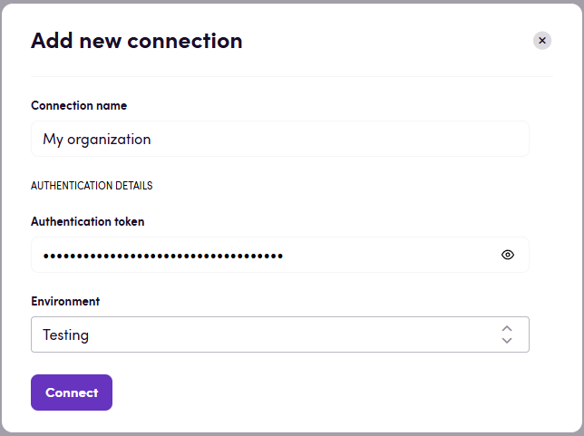

# Blackbird.io Welocalize OPAL

Blackbird is the new automation backbone for the language technology industry. Blackbird provides enterprise-scale automation and orchestration with a simple no-code/low-code platform. Blackbird enables ambitious organizations to identify, vet and automate as many processes as possible. Not just localization workflows, but any business and IT process. This repository represents an application that is deployable on Blackbird and usable inside the workflow editor.

## Introduction

<!-- begin docs -->

Welocalize OPAL is an AI-powered localization platform used to translate and manage multilingual content at scale. 
It combines machine translation, large language models (LLMs) and natural language processing to automatically translate, 
evaluate and improve text across many languages.

## Before setting up

Before you can connect, make sure you have a welocalize OPAL authentication token.

## Connecting

1. Name your connection for future reference e.g. 'My organization'.
2. Paste your authentication token.
3. Choose the environment: either 'Testing' or 'Production' one.
4. Click _Connect_ and wait for the process to complete.
5. Confirm that the connection has appeared and its status is _Connected_.

## Actions

### Project

- **Get project details** Get information about an existing project.
- **Create project** Create a new project.
- **Upload file to project** Upload file to a project.
- **Start project** Start a project.
- **Cancel project** Cancel a project.
- **Complete project** Complete a project.
- **Download project file** Download a processed project file.

## Events

### Project

- **On project status changed** Triggers when the status of a specified project changes.

## Feedback

Do you want to use this app or do you have feedback on our implementation? Reach out to us using the [established channels](https://www.blackbird.io/) or create an issue.

<!-- end docs -->
